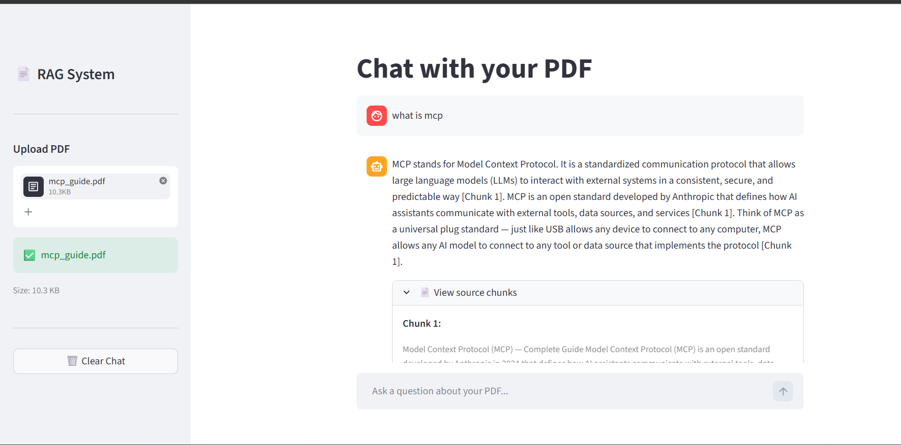

# 🔍 Production RAG System

A production-grade Retrieval Augmented Generation (RAG) system built with hybrid search, cross-encoder reranking, citation enforcement, query rewriting, and automated evaluation.



## 🚀 Features

- **Hybrid Search** — Combines BM25 keyword search with ChromaDB vector search for better retrieval
- **Cross-Encoder Reranking** — Rescores retrieved chunks using sentence-transformers for improved precision
- **Citation Enforcement** — System refuses to answer if retrieved chunks don't support the response
- **Query Rewriting** — Rewrites follow-up questions into standalone queries using a small LLM
- **Automated Evaluation** — Custom evaluation framework measuring Faithfulness, Answer Relevancy, and Context Precision
- **Prompt Versioning** — All prompts stored in YAML config files for version control
- **Cache System** — Skips reprocessing for previously uploaded PDFs

## 🏗️ Architecture

```
User uploads PDF
      ↓
PyPDFLoader → RecursiveCharacterTextSplitter (2000 chars, 400 overlap)
      ↓
HuggingFace Embeddings (all-MiniLM-L6-v2) → ChromaDB
BM25Okapi Index → Pickle file
      ↓
User asks question
      ↓
Query Rewriting (llama-3.1-8b-instant) — only when pronouns detected
      ↓
Hybrid Search (ChromaDB + BM25) → top 10 chunks
      ↓
Cross-Encoder Reranking (ms-marco-MiniLM-L-6-v2) → top 5 chunks
      ↓
Prompt Builder (YAML versioned prompts)
      ↓
Groq LLM (llama-3.3-70b-versatile) → Answer with citations
      ↓
Citation Enforcement → validate response has chunk citations
      ↓
Streamlit UI
```

## 📊 Evaluation Results

Evaluated on MCP Guide PDF with 10 question golden dataset:

| Metric | Score |
|--------|-------|
| Faithfulness | 1.000 |
| Answer Relevancy | 0.900 |
| Context Precision | 0.850 |
| **Overall** | **0.917** |

## 🛠️ Tech Stack

| Component | Technology |
|-----------|------------|
| LLM | Groq (llama-3.3-70b-versatile) |
| Embeddings | HuggingFace (all-MiniLM-L6-v2) |
| Vector Store | ChromaDB |
| Keyword Search | BM25 (rank-bm25) |
| Reranking | CrossEncoder (ms-marco-MiniLM-L-6-v2) |
| Orchestration | LangChain |
| Frontend | Streamlit |
| Evaluation | Custom LLM-based evaluator |

## ⚙️ How to Run Locally

**1. Clone the repository:**
```bash
git clone https://github.com/Uday1vADDE/production-rag.git
cd production-rag
```

**2. Create virtual environment:**
```bash
python -m venv venv
venv\Scripts\activate  # Windows
```

**3. Install dependencies:**
```bash
pip install -r requirements.txt
```

**4. Set up environment variables:**
```bash
# Create .env file and add your Groq API key
GROQ_API_KEY=your_groq_api_key_here
```

**5. Run the app:**
```bash
streamlit run app.py
```

**6. Run evaluation:**
```bash
python src/evaluate.py
```

## 📁 Project Structure

```
production-rag/
├── src/
│   ├── ingest.py        # PDF loading, chunking, embedding, storage
│   ├── retrieval.py     # Hybrid search and reranking
│   ├── pipeline.py      # RAG pipeline with query rewriting
│   └── evaluate.py      # Automated evaluation framework
├── prompts/
│   └── rag_prompt.yaml  # Versioned prompt templates
├── evaluation/
│   ├── golden_dataset.json  # Test questions with ground truth
│   └── results.json         # Evaluation results
├── screenshots/
│   └── app_demo.png     # App screenshot
├── app.py               # Streamlit frontend
├── requirements.txt     # Project dependencies
└── .env                 # API keys (not committed)
```

## 🔑 Key Engineering Decisions

- **Hybrid search over pure vector search** — BM25 handles exact keyword matches that semantic search misses
- **Cross-encoder reranking** — Improves precision by scoring query-chunk pairs together instead of independently
- **Prompt versioning in YAML** — Treats prompts as part of system architecture, not hardcoded strings
- **Small LLM for query rewriting** — Uses llama-3.1-8b-instant instead of the main model to save cost
- **Cache system** — Avoids reprocessing same PDFs, saves time and compute
- **Citation enforcement in code** — Uses regex validation instead of relying solely on LLM instructions

## 📚 What I Learned

- The gap between a RAG demo and a production RAG system is enormous
- Hybrid search consistently outperforms pure vector search for technical documents
- Prompt engineering alone is not reliable for critical behavior — code validation is essential
- Evaluation is 70% of the work in production AI systems
- Small models are good enough for simple tasks like query rewriting — saves cost without sacrificing quality
